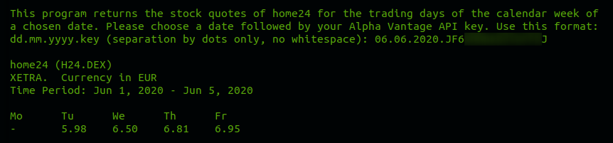

# Stock quotes for home24 SE

**Version 1.0.0**

This script uses the API of Alpha Vantage to retrieve stock quotes for the company home24 SE (XETRA). A user can enter a date. From this date, the script will determine the start and end of the calender week the date falls into. The script will display the stock quotes for the trading days of that calendar week. If a stock quote is not available for a particular trading day (for example: public holiday), the value "-" will be displayed.

---

## Screenshot

---

## Prerequisites

To run this script, you need your own Alpha Vantage API key. You can get a free API key using this link:

[Get an Alpha Vantage API key](https://www.alphavantage.co/)

---

## Installation Instruction

The script is written in JavaScript. To run the script, you need to install Node.js. You can download the Node.js source code or a pre-built installer for your platform using this link:

[Download Node.js](https://nodejs.org/en/download/)

Save the script in a directory of your choice. To run the script, use the terminal and change to the chosen directory. Then run the script by using the following command:

`node script.js`
