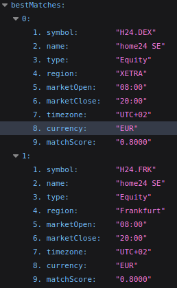

# Description of my approach

The script is composed of three main parts.

## Input and Date calculations

To work with a date and API key put in by the user, I used the `readline` module provided by Node.js. Since a user could choose any date, I used a `switch` statement to determine the start of the calendar week of the chosen date. I conducted the date calculations using the `Date.UTC()` method, so that calculations with the equivalent of one day in milliseconds return valid results.

## HTTP Request and Using the Alpha Vantage API

For the Alpha Vantage API query, I used the following endpoint and path:

`https://www.alphavantage.co/query?`

To retrieve content from a "Daily Adjusted" ["Daily Adjusted"](https://www.alphavantage.co/documentation/) query for home24 the required parameters were `function=TIME_SERIES_DAILY_ADJUSTED`, `symbol` and `apikey`. To find the `symbol` value for home24, I conducted a ["Search Endpoint"](https://www.alphavantage.co/documentation/) query with the parameters `function=SYMBOL_SEARCH`, `keywords=home24` and `apikey`. The two best matches were:

Using `symbol=H24.FRK` resulted in an invalid API call. Therefore, I used `symbol=H24.DEX` as a parameter to build the URL for the HTTP request.

To conduct the HTTP request, I used the `https` module provided by Node.js. I used the variable `stockData` to store all the incoming data pieces of the response. I used the `JSON.parse()` method, to transform the data into a JavaScript object.

Because the JavaScript object has several nested objects, I created a new object called `stockValuePerDay` with all the trading days as properties and the corresponding stock closing value as their values.

## Collecting the Stock Values for the Chosen Calendar Week

I then created the array `stockValuesOfCalendarWeek`, to hold the adjusted closing values for each trading day of the calendar week. I used an `if...else` statement to deal with trading days, that have no corresponding values (e.g. because that day was a public holiday). In this case `"-"` shall be displayed as a value.
